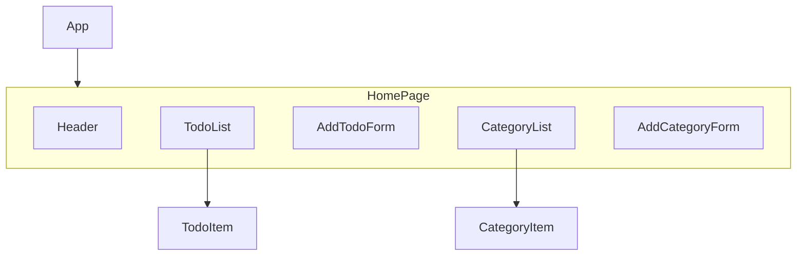

# Todo UI Component Design

This document outlines the component architecture for the `todo-ui` React application.

## Component Hierarchy

The application will be structured with the following component hierarchy:

## Component Responsibilities

### `App`
- The root component of the application.
- Renders the `HomePage`.

### `HomePage`
- The main page of the application.
- Contains all the main UI components.

### `Header`
- Displays the application title.
- May contain user information and a logout button in the future.

### `TodoList`
- Fetches and displays the list of tasks.
- Manages the state of the tasks (e.g., loading, error).
- Renders a `TodoItem` for each task.

### `TodoItem`
- Displays a single task with its title, description, and due date.
- Allows the user to mark a task as complete.
- Provides buttons for editing and deleting a task.

### `AddTodoForm`
- A form for adding a new task.
- Contains input fields for the task title, description, and category selection.
- Handles form submission and calls the API to create a new task.

### `CategoryList`
- Fetches and displays the list of categories.
- Allows the user to filter tasks by category.
- Renders a `CategoryItem` for each category.

### `CategoryItem`
- Displays a single category.
- When clicked, it will filter the tasks in the `TodoList`.

### `AddCategoryForm`
- A form for adding a new category.
- Contains an input field for the category name.
- Handles form submission and calls the API to create a new category.